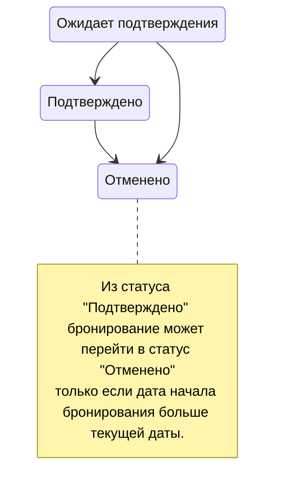

# Микросервис бронирования отелей

# Описание проекта
Существует система бронирования отелей. Отели подключаются к системе и предоставляют информацию о себе и доступных для бронирования ресурсах (номера, виллы, etc.), формируя каталог ресурсов.

Необходимо разработать микросервис бронирования ресурсов, который будет предоставлять следующую функциональность:
- Создание бронирования
- Получение бронирований по фильтру
- Получение бронирования по Id
- Получение статуса бронирования по Id
- Отмена бронирования

# Цель проекта

Развить навыки необходимые для реализации микросервиса, который взаимодействует c другими микросервисами и использует для хранения данных РСУБД:
- Реализация WebApi
- Обработка исключений в ASP.NET по формату Problem Details
- Реализация бизнес-логики приложения
- Взаимодействие с БД 
- Реализация синхронных взаимодействий
- Реализация асинхронных взаимодействий
- Написание unit-тестов

# Используемые технологии и пакеты

- Docker
- PostgreSQL
- RabbitMQ
- EntityFramework Core
- Rebus
- Serilog
- xUnit

# Описание предметной области

## Бронирование (Booking)

| Свойство                                            | Тип данных     | Ограничения                                        |
|-----------------------------------------------------|----------------|----------------------------------------------------|
| Идентификатор                                       | long           | Больше 0 Присваивается в БД                        |
| Статус                                              | BookingStatus  | Имеет значение из enum BookingStatus               |
| Идентификатор пользователя, создавшего бронирование | long           | Больше 0                                           |
| Идентификатор бронируемого ресурса                  | long           | Больше 0                                           |
| Дата начала бронирования                            | DateOnly       | Больше текущей даты                                |
| Дата окончания бронирования                         | DateOnly       | Больше даты начала бронирования                    |
| Дата и время создания бронирования                  | DateTimeOffset | Равна текущей дате на момент создания бронирования |

### Статусная модель бронирования
`BookingStatus` включает следующие статусы:
- Ожидает подтверждения (AwaitsConfirmation)
- Подтверждено (Confirmed)
- Отменено (Cancelled)

Бронирование создается в статусе `AwaitsConfirmation`.

#### Модель переходов

# Требования

- При реализации должно использоваться асинхронное программирование. `async/await`, `Task`, `Task<T>`.
- Сервис должен реализовывать все методы из раздела [Синхронный API](#Синхронный%20API).
- Данные должны храниться в PostgreSQL и использовать реляционную модель. Хранение в json не допускается.
- Для асинхронных взаимодействий используется RabbitMq и библиотека Rebus + Rebus.RabbitMq.

## Синхронный API

| Название метода | Тип | Описание | Требования | Входные параметры | Возвращаемое значение |
| ---- | ---- | ---- | ---- | ---- | ---- |
| Создание бронирования | POST | Создает бронирование в статусе "Ожидает подтверждения" | В момент создания бронирования микросервис должен обратиться в микросервис "Каталог", чтобы подтвердить бронирование ресурса. Не все отели используют автоматизацию, поэтому подтверждение может занимать до 1 часа. | Идентификатор пользователя создавшего бронирование   Идентификатор бронируемого ресурса  Дата начала бронирования  Дата окончания бронирования | Идентификатор созданного бронирования  Или ошибка по формату ProblemDetails |
| Получение бронирований с фильтром | POST | Возвращает список бронирований с фильтром и пагинацией. В случае, если все поля фильтра не заданы, возвращает все бронирования. | Должна быть возможность фильтровать данные по полям:  Идентификатор пользователя, создавшего бронирование  Идентификатор ресурса  Пагинация:  Номер страницы данных  Размер страницы (количество записей на странице) | Все поля фильтра необязательные.  При наличии заполненных полей в запросе они должны использоваться для фильтрации данных по правилу И.  Для пагинации следует использовать limit ... offset в БД. Нужно вычислить сколько строк пропустить на основании номера запрашиваемой страницы и ее размера.  Так как для пагинации нужна сортировка, данные сортируем по ключу Id в порядке убывания (DESC).  Если поля пагинации не заполнены, то использовать значения по умолчанию: 1, 25  | Список бронирований. Состав полей такой же как в методе получения бронирования по идентификатору  Или ошибка по формату ProblemDetails |
| Отмена бронирования | POST | Отменяет бронирование  | Микросервис должен обратиться в микросервис "Каталог" для того, чтобы отменить бронь ресурса | Идентификатор бронирования | Ничего  Или ошибка по формату ProblemDetails |
| Получение бронирования по Id | GET | Возвращает информацию по бронированию с заданным идентификатором | В случае, если бронирование не найдено, нужно вернуть null | Идентификатор бронирования | Информация о бронировании: Идентификатор; Статус; Идентификатор пользователя, создавшего бронирование; Идентификатор бронируемого ресурса; Дата начала бронирования; Дата окончания бронирования; Дата и время создания бронирования  Или ошибка по формату ProblemDetails  |
| Получение статуса бронирования по Id | GET | Возвращает статус бронирования по идентификатору бронирования | При чтении статуса из БД должно читаться только поле статуса | Идентификатор бронирования | Статус бронирования   Или ошибка по формату ProblemDetails |

## Функциональность подтверждения бронирований

После создания бронирования в статусе "Ожидает подтверждения" необходимо отслеживать факт подтверждения бронирования ресурса в сервисе каталоге. Для этого необходимо раз в интервал времени опрашивать микросервис "Каталог". В случае подтверждения или отказа обновлять статус бронирования. 
Данная функциональность должна учитывать, что микросервис может быть запущен в несколько экземпляров. Не допускается обработка одного и того же бронирования на нескольких экземплярах. Для этого нужно предусмотреть пессимистические блокировки.
# API сервиса "Каталог"

## Синхронный API

[BookingService.Catalog.Api.Contracts](https://www.nuget.org/packages/BookingService.Catalog.Api.Contracts/) - nuget-пакет с синхронными контрактами сервиса Catalog.

| Метод | Тип | Описание | Входные параметры | Выходные параметры |
| ---- | ---- | ---- | ---- | ---- |
| Создать заявку на бронирование ресурса | POST | Создает заявку на бронирование ресурса. Спустя время, заявка перейдет в статус "Подверждено" или "Отказано".  Пока ресурс забронирован, он недоступен для дальнейшего бронирования. | **Guid**: *RequestId* - распределенный идентификатор заявки;  **long**: *ResourceId* - Идентификатор ресурса.  **DateOnly**: *StartDate* - Дата начала бронирования  **DateOnly**: *EndDate* - Дата окончания бронирования | **long**: *JobId* - Идентификатор заявки  Или ошибка по формату ProblemDetails |
| Отменить заявку на бронирование ресурса | POST | Отменяет заявку на бронирование ресурса. | **Guid**: *RequestId* - распределенный идентификатор заявки; | Ошибка по формату ProblemDetails, если не удалось обновить заявку |
| Получить список отелей с ресурсами | POST | Возвращает список отелей | **bool**: *OnlyAvailableResources* - Фильтр только доступных ресурсов | **HotelData**: Информация об отеле: |
| Получить статус заявки на бронирование ресурса по распределенному идентификатору заявки | POST | Возвращает статус заявки на бронирование по распределенному идентификатору заявки | **Guid**: *RequestId* - распределенный идентификатор заявки; | **JobStatus**: *Status* - Статус заявки |

## Модели данных

### HotelData

**long**: *Id* - Идентификатор отеля  
**string**: *Name* - Название отеля  
**ResourceData[]**: *Resources* - Список ресурсов  

### ResourceData

**long**: *Id* - Идентификато ресурса  
**string**: *Name* - Название ресурса  
**bool**: *Available* - Доступность для бронирования  
**DateOnly?**: *BookedFrom* - Дата начала бронирования  
**DateOnly?**: *BookedTo* - Дата окончания бронирования  

### JobStatus - Статус заявки на бронирование

Новая = 1  
Подтверждено = 2  
Отказано = 3  
Отменена = 4

## Асинхронный API

[BookingService.Catalog.Async.Api.Contracts](https://www.nuget.org/packages/BookingService.Catalog.Async.Api.Contracts/) - nuget-пакет с асинхронными контрактами сервиса Catalog.

| Название | Тип | Описание | Состав |
| ---- | ---- | ---- | ---- |
| **CreateBookingJobRequest** | Команда | Запрос создания заявки на бронирование. Аналог синхронного метода "Создать заявку на бронирование ресурса" | **Guid**: *EventId* - идентификатор события.  **Guid**: *RequestId* - распределенный идентификатор заявки;  **long**: *ResourceId* - Идентификатор ресурса.  **DateOnly**: *StartDate* - Дата начала бронирования  **DateOnly**: *EndDate* - Дата окончания бронирования |
| **CreateBookingJobByRequestIdRequest** | Команда | Запрос отмены заявки на бронирование. Аналог синхронного метода "Отменить заявку на бронирование ресурса" | **Guid**: *EventId* - идентификатор события.  **Guid**: *RequestId* - распределенный идентификатор заявки; |
| **BookingJobConfirmed** | Событие | Положительный результат обработки заявки на бронирование | **Guid**: *EventId* - идентификатор события.  **Guid**: *RequestId* - распределенный идентификатор заявки;  **long**: *Id* - Идентификатор заявки на бронирование. |
| **BookingJobDenied** | Событие | Отрицательный результат обработки заявки на бронирование | **Guid**: *EventId* - идентификатор события.  **Guid**: *RequestId* - распределенный идентификатор заявки;  **long**: *Id* - Идентификатор заявки на бронирование.  **string**: *Reason* - причина отказа  |
